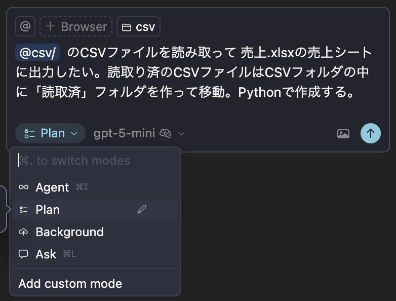
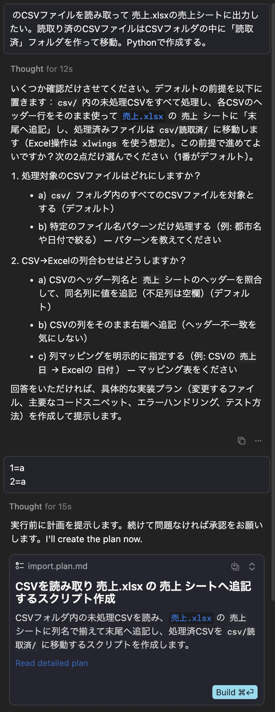
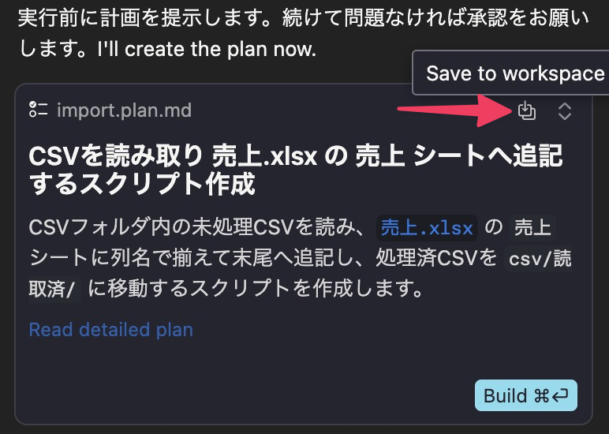
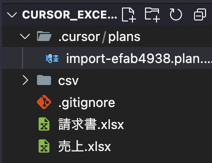
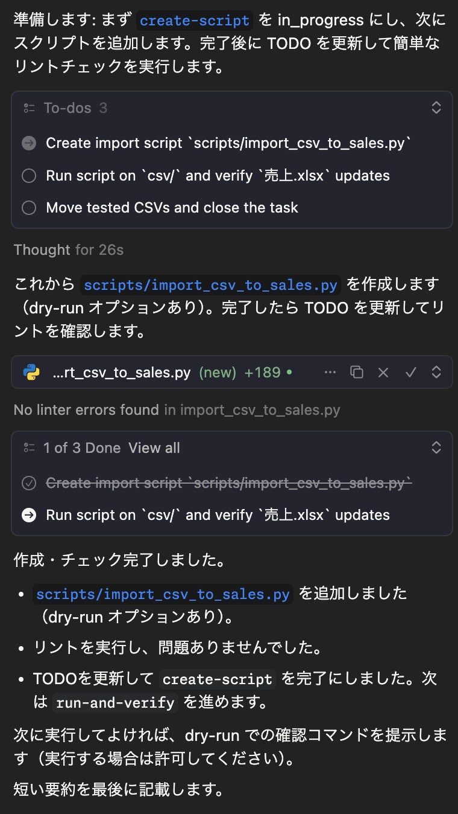
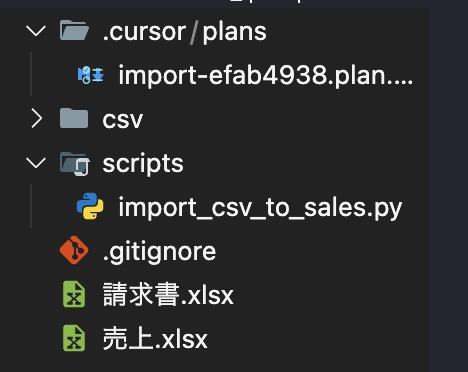

# 009_ 標準 Plan モードで CSV ファイル取込の仕様書作成

標準の Plan モードでも、後述するカスタムモードによる Plan モードでも、仕様書を作成する流れはそれほど変わりません。

## モードの選択とプロンプト入力

標準の Plan モードを使うには、チャット欄でモード選択するときに「Plan」を選択し、作りたいプログラムの要件を入力します。

```
@csv のCSVファイルを読み取って売上.xISXの売上シート
に出力したい。読取り済のCSVファイルはCSVフォルダの中に「読取済」フォルダを作って移動。Pythonで作成する。
```



`@csv/` はメンションで、対象のファイルやフォルダを指定するときに使います。

### @ シンボルについての捕捉

ここで初めて登場した `@` について触れておきます。いわゆるメンションというやつで、対象のファイルやフォルダを指定するときに使う記号です。`@` に続いて csv と入力し、Enter キーを押すと少し色が変わります。キーボードから入力する方法の他に、マウスでファイルやフォルダをドラッグしても OK です。


なお、`@` を使うときに前後に全角文字があるとうまく機能しませんので注意してください。

`@` については以下の公式ドキュメントも参考にしてください。

[Cursor – @ symbols](https://docs.cursor.com/context/@-symbols/overview)

## AI との対話

プロンプトを送信すると AI からの確認事項が表示されます。 AI 求めに応じて選択します。AI からの確認が終わると、マークダウンファイルで仕様書が作られます。



import.plan.md という名前で作成されました。以下のような内容です (macOS)。ファイルの中身を確認し、よくわからない箇所がある場合は AI に質問し、必要に応じて修正してください。ここでは AI が提出してきたものをそっくり修正せずに利用します。

~~~
# CSVを読み取り `売上.xlsx` の `売上` シートへ追記するスクリプト作成

**概要**

- 作成対象: `scripts/import_csv_to_sales.py`（Python）
- 振る舞い: `csv/` 内のすべての `.csv` ファイルを処理。各CSVのヘッダー名で `売上` シートのヘッダーと照合し、同名列へ値を追記。シートに存在しない列は末尾に追加して追記する。処理済ファイルは `csv/読取済/` に移動する。
- ライブラリ: `xlwings` を使用（ユーザの希望に従う）[[memory:7074546]]。標準の `csv` と `shutil` を併用。
- 前提: `売上.xlsx` はリポジトリルートにあり、対象シート名は `売上`。CSVはUTF-8かつカンマ区切り。

**実装手順**

1. `scripts/import_csv_to_sales.py` を新規作成。
2. スクリプトの主要処理
   - `xlwings.Book('売上.xlsx')` でブックを開き、`Book.sheets['売上']` を取得。
   - シートの先頭行（ヘッダー）を取得して `excel_headers` を構築。
   - `csv/` をスキャンし、`讀取済` フォルダを除く全 `.csv` ファイルを対象にループ。
   - 各CSVは `csv.DictReader` で読み、CSVヘッダーと `excel_headers` の和集合を計算。シートに新しい列があればヘッダー行を拡張する。
   - 各CSV行ごとに `excel_headers` の順で値リストを作り、シートの末尾行へ追記する。
   - ファイル単位でエラーはログして続行。処理成功後は `csv/読取済/` を作成して移動（`shutil.move`）。
   - 最後に `book.save()` を呼ぶ（必要であれば都度保存）。

**例: 主要処理の簡潔なコードスニペット**

```python
import csv
import xlwings as xw
from pathlib import Path
import shutil

BOOK_PATH = Path('売上.xlsx')
CSV_DIR = Path('csv')
PROCESSED_DIR = CSV_DIR / '読取済'

with xw.App(visible=False) as app
    book = xw.Book(BOOK_PATH)
    sheet = book.sheets['売上']
    excel_headers = sheet.range('1:1').value or []

    for csv_path in CSV_DIR.glob('*.csv')
        if csv_path.parent.name == '読取済'
            continue
        with csv_path.open('r', encoding='utf-8') as f
            reader = csv.DictReader(f)
            csv_headers = reader.fieldnames or []
            # ヘッダーの和集合を取り、必要ならシートヘッダーを更新
            # 各行を整形して sheet.append を使い追記
        shutil.move(str(csv_path), str(PROCESSED_DIR/csv_path.name))
    book.save()
```

**ロバストネス / エラーハンドリング**

- 空ファイルやヘッダーなしCSVはスキップしてログ出力。
- 1ファイルの失敗で全体停止しない（例外は捕捉して次へ）。
- `csv/読取済/` がなければ作成する。

**テスト手順**

- まず `--dry-run` モードで変更前の動作確認（移動・保存は行わず、表示のみ）。
- 正常だったら実行モードでリポジトリ内の `csv/` を処理し、`売上.xlsx` が期待どおり更新され、各CSVが `csv/読取済/` に移動されたことを確認する。

**注意・仮定**

- CSVのエンコーディングはUTF-8。必要ならSJIS等の判定追加可能。
- `売上` シートのヘッダーは1行目にあると仮定。

### 実装TODO（承認後に実行）

- id: create-script, content: Create import script `scripts/import_csv_to_sales.py`
- id: run-and-verify, content: Run script on `csv/` and verify `売上.xlsx` updates
- id: finalize, content: Move tested CSVs and close the task
~~~

ただし、この内容はプロジェクト内にファイルとして保存されているわけではありません。保存したい場合は、「Save to workspace」ボタンを押してください。



`.cursor/plans` に保存されます。また、「Build」ボタンを押すとプログラム作成が開始されます。



## Build ボタンで実装

Build ボタンをクリックすると下の図のように表示され、実装が始まります。



`scripts` フォルダ配下に作られました。



このような流れで仕様書作成とプログラムを実装できます。ただ、簡単なものであれば標準の Plan モードで十分ですが、複雑なものの場合は、この後解説するカスタムモードによる Plan モードに分があります。

そのため、本書ではカスタムモードによる Plan モードで実装・解説することとします。今回作成されたフォルダと配下のファイルが残っていると影響を受けてしまうため、すべて削除しておいてください。

## 使用したトークンの確認

チャット末尾を見ると `n%` という表記があります。これは各 AI に設定されているトークンに対して今のスレッドがどの程度使用しているか、というものです。

トークンがいっぱいになると AI の頭が悪くなっていきます。以前行ったやりとりを忘れて同じ事を何度もループする、といったことが起きます。スレッドで使用中のトークンを横目で見ながら進めてください。


トークンがいっぱいになったら新しいチャットを始めるようにしてください。新しいチャットでは、@を使って Past Chats の中から以前のチャットを選ぶと良いです。そのチャットを要約して AI、それを元に回答してくれます。


